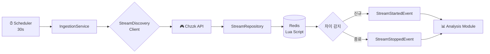
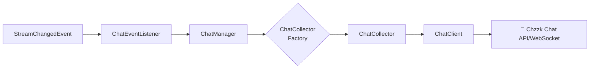

# stream-engine
## 프로젝트 설명
- Java 25 가상 스레드(Virtual Threads) 기반의 실시간 스트림 데이터 수집 및 분석 엔진
- 라이브 스트리밍 플랫폼(Chzzk 등)의 방대한 데이터를 실시간으로 수집하여 <br>
  비즈니스 분석과 하이라이트를 추출하는 chzzSlice 서비스의 코어 엔진입니다.


## 기술 스택
### Core
- Java 25 (Virtual Threads)
- Spring Boot 4.0.1
- Spring Data Redis
- Spring Scheduling
### Infrastructure
- Redis 7 (Lua Script)
- Lettuce (Redis Client)
- RestClient (HTTP Client)
### Testing
- JUnit 5
- Mockito
- TestContainers (Redis)
- AssertJ

## 🏗️ 아키텍처

### Clean Architecture 기반 모듈 구조
```text
stream-engine/
├── core/             # 공통 도메인 모델
│ └── model/
│ └── StreamTarget     # 스트림 타겟 정보
│
├── ingestion/       # 수집 모듈
│ ├── application/    # 유스케이스 계층
│ │ └── IngestionService
│ ├── domain/         # 도메인 계층
│ │ ├── client/        # 외부 클라이언트 인터페이스
│ │ ├── event/         # 도메인 이벤트
│ │ ├── model/         # 도메인 모델
│ │ └── repository/    # 저장소 인터페이스
│ └── infrastructure/ # 인프라 계층
│ ├── chzzk/           # Chzzk API 클라이언트
│ ├── redis/           # Redis 저장소 구현
│ └── config/          # 인프라 설정
│
├── chat/            # 💬 실시간 채팅 데이터 수집
│ └── application/    # 유스케이스 계층
│ └── domain/         # 도메인 계층
│ └── infrastructure/ # 인프라 계층
├── analysis/        # 📊 분석 모듈 (🚧 예정)
│ └── ...
│
├── highlight/       # ⭐ 하이라이트 추출 (🚧 예정)
│ └── ...
│
└── global/          # 전역 설정
├── config/           # 스케줄링 등
├── error/            # 예외 처리
└── aop/              # 횡단 관심사
```
## 🎯 Ingestion 모듈 (v1.0)
### 핵심 기능

#### 1. 주기적 스트림 수집
- **30초 주기**로 상위 20개 라이브 스트림 탐색
- 신규 시작/종료된 스트림 자동 감지
- 도메인 이벤트 발행으로 다른 모듈과 연동
#### 2. Redis 기반 상태 관리
- **Lua Script**를 활용한 원자적 상태 업데이트
- Set 연산으로 O(N) 시간복잡도 차이 감지
- Hash 구조로 스트림 상세 정보 저장

#### 3. 확장 가능한 이벤트 시스템
- `StreamStartedEvent`: 신규 방송 시작
- `StreamStoppedEvent`: 방송 종료
- Spring Event 기반 느슨한 결합

### 데이터 플로우



### 💬 Chat 모듈 (v1.0)
#### 핵심 기능
1.  **실시간 채팅 데이터 수집**
    *   Ingestion 모듈에서 전달된 스트림 변경 이벤트에 따라 채팅 수집기 관리
    *   새로운 스트림에 대한 채팅 수집 시작 및 종료된 스트림에 대한 채팅 수집 중단
2.  **확장 가능한 채팅 클라이언트**
    *   `ChatClient` 인터페이스를 통해 다양한 스트리밍 플랫폼의 채팅 데이터 수집 지원
    *   현재 Chzzk 플랫폼 지원

#### 데이터 플로우

