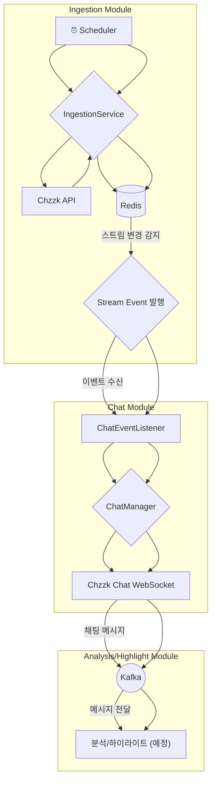

# stream-engine
## 프로젝트 설명
- Java 25 가상 스레드(Virtual Threads) 기반의 실시간 스트림 데이터 수집 및 분석 엔진
- 라이브 스트리밍 플랫폼(Chzzk 등)의 방대한 데이터를 실시간으로 수집하여 <br>
  비즈니스 분석과 하이라이트를 추출하는 chzzSlice 서비스의 코어 엔진입니다.


## 기술 스택
### Core
- Java 25 (Virtual Threads)
- Spring Boot 4.0.1
- Spring Data Redis
- Spring Scheduling
- Spring Kafka
### Infrastructure
- Redis 7 (Lua Script)
- Lettuce (Redis Client)
- RestClient (HTTP Client)
- Kafka
### Testing
- JUnit 5
- Mockito
- TestContainers (Redis, Kafka)
- AssertJ

## 🚀 실행 방법

프로젝트 루트 디렉토리에서 아래 명령어를 실행하여 애플리케이션을 시작합니다.

```bash
./gradlew bootRun
```

## 🏗️ 아키텍처

### 전체 플로우


1.  **스트림 수집**: `Scheduler`가 30초마다 `IngestionService`를 실행하여 치지직의 상위 라이브 스트림 목록을 가져옵니다.
2.  **상태 관리 및 이벤트 발행**: `Redis`에 저장된 기존 스트림 목록과 비교하여 새로 시작되거나 종료된 스트림을 감지하고, `StreamStartedEvent` 또는 `StreamStoppedEvent`를 발행합니다.
3.  **채팅 수집기 관리**: `ChatEventListener`가 스트림 이벤트를 수신하여 `ChatManager`에게 특정 스트림의 채팅 수집기(Collector)를 생성하거나 제거하도록 요청합니다.
4.  **실시간 채팅 수집**: 생성된 채팅 수집기는 해당 스트림의 치지직 채팅 서버(WebSocket)에 연결하여 실시간으로 채팅 메시지를 수집합니다.
5.  **메시지 큐잉**: 수집된 채팅 메시지는 후속 비동기 처리를 위해 `Kafka`로 전송됩니다.
6.  **분석 및 하이라이트 추출 (예정)**: Kafka에 적재된 채팅 데이터를 분석하여 하이라이트 구간을 추출합니다.

### Clean Architecture 기반 모듈 구조
```text
stream-engine/
├── core/             # 공통 도메인 모델
│ └── model/
│ └── StreamTarget     # 스트림 타겟 정보
│
├── ingestion/       # 수집 모듈
│ ├── application/    # 유스케이스 계층
│ │ └── IngestionService
│ ├── domain/         # 도메인 계층
│ │ ├── client/        # 외부 클라이언트 인터페이스
│ │ ├── event/         # 도메인 이벤트
│ │ ├── model/         # 도메인 모델
│ │ └── repository/    # 저장소 인터페이스
│ └── infrastructure/ # 인프라 계층
│ ├── chzzk/           # Chzzk API 클라이언트
│ ├── redis/           # Redis 저장소 구현
│ └── config/          # 인프라 설정
│
├── chat/            # 💬 실시간 채팅 데이터 수집
│ └── application/    # 유스케이스 계층
│ └── domain/         # 도메인 계층
│ └── infrastructure/ # 인프라 계층
├── analysis/        # 📊 실시간 채팅 분석
│ ├── application/    # 유스케이스 계층
│ │ └── ChatAnalysisService
│ ├── domain/         # 도메인 계층
│ │ ├── ChatRoomAnalysis
│ │ └── ChatRoomAnalysisRepository
│ └── infrastructure/ # 인프라 계층
│   └── RedisChatRoomAnalysisRepository
│
├── highlight/       # ⭐ 하이라이트 추출 (🚧 예정)
│ └── ...
│
└── global/          # 전역 설정
├── config/           # 스케줄링 등
├── error/            # 예외 처리
└── aop/              # 횡단 관심사
```

