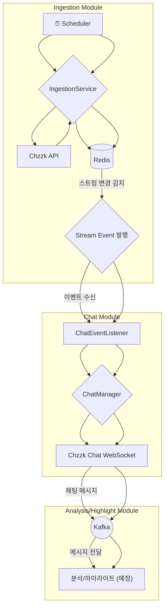
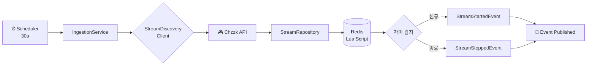
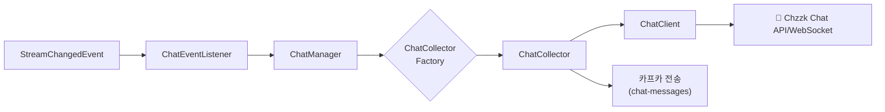

# stream-engine
## 프로젝트 설명
- Java 25 가상 스레드(Virtual Threads) 기반의 실시간 스트림 데이터 수집 및 분석 엔진
- 라이브 스트리밍 플랫폼(Chzzk 등)의 방대한 데이터를 실시간으로 수집하여 <br>
  비즈니스 분석과 하이라이트를 추출하는 chzzSlice 서비스의 코어 엔진입니다.


## 기술 스택
### Core
- Java 25 (Virtual Threads)
- Spring Boot 4.0.1
- Spring Data Redis
- Spring Scheduling
- Spring Kafka
### Infrastructure
- Redis 7 (Lua Script)
- Lettuce (Redis Client)
- RestClient (HTTP Client)
- Kafka
### Testing
- JUnit 5
- Mockito
- TestContainers (Redis, Kafka)
- AssertJ

## 🚀 실행 방법

프로젝트 루트 디렉토리에서 아래 명령어를 실행하여 애플리케이션을 시작합니다.

```bash
./gradlew bootRun
```

## 🏗️ 아키텍처

### 전체 플로우


1.  **스트림 수집**: `Scheduler`가 30초마다 `IngestionService`를 실행하여 치지직의 상위 라이브 스트림 목록을 가져옵니다.
2.  **상태 관리 및 이벤트 발행**: `Redis`에 저장된 기존 스트림 목록과 비교하여 새로 시작되거나 종료된 스트림을 감지하고, `StreamStartedEvent` 또는 `StreamStoppedEvent`를 발행합니다.
3.  **채팅 수집기 관리**: `ChatEventListener`가 스트림 이벤트를 수신하여 `ChatManager`에게 특정 스트림의 채팅 수집기(Collector)를 생성하거나 제거하도록 요청합니다.
4.  **실시간 채팅 수집**: 생성된 채팅 수집기는 해당 스트림의 치지직 채팅 서버(WebSocket)에 연결하여 실시간으로 채팅 메시지를 수집합니다.
5.  **메시지 큐잉**: 수집된 채팅 메시지는 후속 비동기 처리를 위해 `Kafka`로 전송됩니다.
6.  **분석 및 하이라이트 추출 (예정)**: Kafka에 적재된 채팅 데이터를 분석하여 하이라이트 구간을 추출합니다.

### Clean Architecture 기반 모듈 구조
```text
stream-engine/
├── core/             # 공통 도메인 모델
│ └── model/
│ └── StreamTarget     # 스트림 타겟 정보
│
├── ingestion/       # 수집 모듈
│ ├── application/    # 유스케이스 계층
│ │ └── IngestionService
│ ├── domain/         # 도메인 계층
│ │ ├── client/        # 외부 클라이언트 인터페이스
│ │ ├── event/         # 도메인 이벤트
│ │ ├── model/         # 도메인 모델
│ │ └── repository/    # 저장소 인터페이스
│ └── infrastructure/ # 인프라 계층
│ ├── chzzk/           # Chzzk API 클라이언트
│ ├── redis/           # Redis 저장소 구현
│ └── config/          # 인프라 설정
│
├── chat/            # 💬 실시간 채팅 데이터 수집
│ └── application/    # 유스케이스 계층
│ └── domain/         # 도메인 계층
│ └── infrastructure/ # 인프라 계층
├── analysis/        # 📊 실시간 채팅 분석
│ ├── application/    # 유스케이스 계층
│ │ └── ChatAnalysisService
│ ├── domain/         # 도메인 계층
│ │ ├── ChatRoomAnalysis
│ │ └── ChatRoomAnalysisRepository
│ └── infrastructure/ # 인프라 계층
│   └── RedisChatRoomAnalysisRepository
│
├── highlight/       # ⭐ 하이라이트 추출 (🚧 예정)
│ └── ...
│
└── global/          # 전역 설정
├── config/           # 스케줄링 등
├── error/            # 예외 처리
└── aop/              # 횡단 관심사
```
### 🎯 Ingestion 모듈 (v1.0)
#### 핵심 기능

#### 1. **주기적 스트림 수집**
*   **30초 주기**로 상위 20개 라이브 스트림 탐색
*   신규 시작/종료된 스트림 자동 감지
*   도메인 이벤트 발행으로 다른 모듈과 연동
#### 2. Redis 기반 상태 관리
*   **Lua Script**를 활용한 원자적 상태 업데이트
*   Set 연산으로 O(N) 시간복잡도 차이 감지
*   Hash 구조로 스트림 상세 정보 저장

#### 3. 확장 가능한 이벤트 시스템
  * `StreamStartedEvent`: 신규 방송 시작
  * `StreamStoppedEvent`: 방송 종료
  * Spring Event 기반 느슨한 결합

#### 데이터 플로우



### 💬 Chat 모듈 (v1.0)
#### 핵심 기능
#### 1. 실시간 채팅 데이터 수집 및 Kafka 전송
*   Ingestion 모듈에서 전달된 스트림 변경 이벤트에 따라 채팅 수집기 관리
*   새로운 스트림에 대한 채팅 수집 시작 및 종료된 스트림에 대한 채팅 수집 중단
*   수집된 채팅 메시지를 Kafka `chat-messages` 토픽으로 전송
#### 2. 확장 가능한 채팅 클라이언트
*   `ChatClient` 인터페이스를 통해 다양한 스트리밍 플랫폼의 채팅 데이터 수집 지원
*   현재 Chzzk 플랫폼 지원

#### 데이터 플로우


### 📊 Analysis 모듈 (v1.1)
#### 핵심 기능
#### 1. 실시간 채팅 수 분석
*   Kafka `chat-messages` 토픽으로부터 메시지를 수신하여 스트림별 분당 채팅 수를 실시간으로 집계합니다.
*   집계된 데이터는 하이라이트 구간 탐지 및 실시간 대시보드 표시에 사용됩니다.

#### 2. Caffeine 캐시 기반 메모리 관리
*   **메모리 누수 방지**: 활성 스트림의 분석 데이터만 메모리에 유지하기 위해 Caffeine 캐시를 사용합니다.
*   **TTL(Time-To-Live) 만료 정책**: 특정 시간(예: 30분) 동안 새로운 채팅이나 조회 활동이 없는 비활성 스트림의 데이터는 캐시에서 자동으로 제거하여 메모리 사용량을 최적화합니다.

#### 3. 주기적인 데이터 저장
*   Spring Scheduler를 사용하여 10초마다 메모리에 집계된 분석 데이터를 RedisTimeSeries에 저장합니다.
*   이를 통해 데이터 영속성을 확보하고 시계열 분석을 위한 기반을 마련합니다.

#### 4. 채팅 화력 조회 API
*   저장된 스트림별 시계열 분석 데이터를 조회할 수 있는 REST API 엔드포인트(`GET /api/v1/analysis/{streamId}`)를 제공합니다.
*   이를 통해 Grafana와 같은 외부 시각화 도구나 클라이언트 애플리케이션에서 데이터를 활용할 수 있습니다.

#### 데이터 플로우
```mermaid
flowchart LR
    subgraph Write Path
        A["Kafka<br/>(chat-messages)"] --> B[ChatAnalysisService]
        B --> C["Caffeine Cache<br/>(In-Memory Aggregation)"]
        C --> D{Scheduler<br/>10s}
        D --> E["RedisTimeSeries<br/>(분당 채팅 수 저장)"]
    end

    subgraph Read Path
        F[External Client<br/>(e.g., Grafana)] --> G[ChatAnalysisController]
        G --> H[ChatAnalysisService]
        H --> I["RedisTimeSeries<br/>(채팅 기록 조회)"]
        I --> G
    end
```
