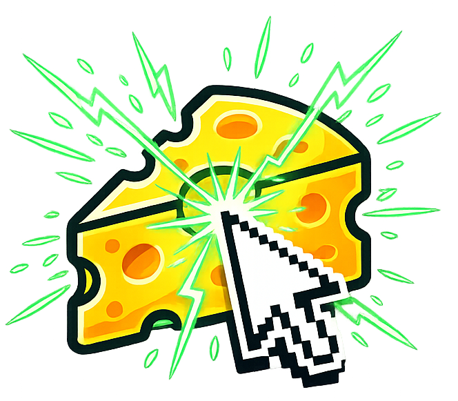
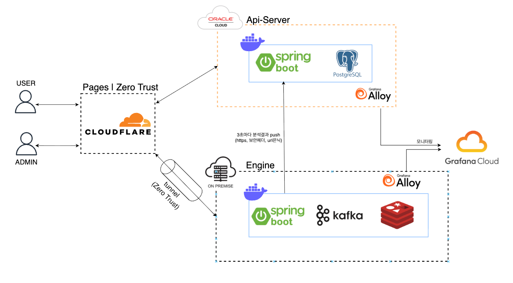
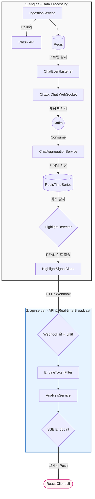

  <h1>
    치즈픽 (Cheese-Pick)
  </h1>
  

    <b>🚀 실시간 스트림 화력 분석 엔진</b>  
    <a href="https://cheesepick.me">cheesepick.me 바로가기</a>
  

 
## 📖 프로젝트 소개
Java 25 가상 스레드(Virtual Threads) 기반의 고성능 실시간 스트림 데이터 수집 및 분석 엔진입니다.
라이브 스트리밍 플랫폼(Chzzk 등)의 대규모 채팅 및 스트림 데이터를 실시간으로 수집하여, 화력이 폭발하는 하이라이트 구간을 자동으로 추출하는 chzzSlice 서비스의 핵심 코어 시스템입니다.

이 프로젝트는 데이터의 수집/분석을 담당하는 `engine`, 외부 통신 및 조회를 담당하는 `api-server`, 그리고 시각화 대시보드인 `client` 3개의 멀티 모듈로 구성되어 있습니다.

---

## ✨ 핵심 기능
- **실시간 데이터 파이프라인**: Chzzk API 및 WebSocket을 통한 스트림 상태 및 채팅 로그 실시간 수집
- **비동기 메시징 처리**: Apache Kafka를 이용한 대용량 채팅 트래픽 버퍼링 및 분산 처리
- **시계열 기반 화력 분석**: RedisTimeSeries 및 커스텀 Lua 스크립트를 활용한 구간별 채팅량 분석 및 `PEAK` 상태 감지
- **보안 통신**: 예측 불가능한 은닉 경로와 시크릿 토큰을 활용한 Engine ↔ API Server 간의 안전한 내부 Webhook 통신

---

## 🛠️ 기술 스택

### Backend (Core & API)
- **Language**: Java 25 (Virtual Threads)
- **Framework**: Spring Boot 4.0.1
- **Data & Messaging**: Spring Data Redis, Spring Kafka
- **Utils**: Spring Scheduling, Jackson, SLF4J

### Infrastructure
- **Database / Cache**: Redis 7.4 (Redis Stack / TimeSeries 내장)
- **Message Broker**: Apache Kafka (Kraft Mode)
- **Containerization**: Docker, Docker Compose

### Frontend (Client) 🤖
> 프로젝트의 핵심 역량은 **백엔드 대용량 트래픽 처리 및 데이터 파이프라인 설계**에 집중되어 있습니다.
> 프론트엔드(`client` 모듈)는 백엔드 엔진의 실시간 데이터(화력 차트)를 시각적으로 검증하기 위해 **LLM을 적극 활용하여 구축한 사용자/관리자 통합 대시보드**입니다.
- **Framework**: React 18, Vite, TypeScript
- **Routing & State**: React Router, Zod (Runtime Type Validation)
- **Styling / UI**: Tailwind CSS, Recharts (Data Visualization)

---

## 🏗️ 아키텍처 및 데이터 플로우

시스템은 역할에 따라 **Engine**, **API Server**, **Client**로 명확히 분리되어 동작합니다.

```mermaid
flowchart TD
    %% Subgraph: Engine Module
    subgraph Engine_Scope [1. engine - Data Processing]
        direction TB
        Ingestion[IngestionService] -->|Polling| ChzzkAPI[Chzzk API]
        Ingestion --> RedisDB[(Redis)]
        RedisDB -->|스트림 감지| ChatListener[ChatEventListener]
        
        ChatListener --> WebSocket[Chzzk Chat WebSocket]
        WebSocket -->|채팅 메시지| KafkaTopic((Kafka))
        
        KafkaTopic -->|Consume| AggService[ChatAggregationService]
        AggService -->|시계열 저장| RedisTS[(RedisTimeSeries)]
        
        RedisTS -->|화력 감지| Detector{HighlightDetector}
        Detector -->|PEAK 신호 발송| SignalClient[HighlightSignalClient]
    end

    %% Subgraph: API Server Module
    subgraph API_Scope [2. api-server - API & Real-time Broadcast]
        direction TB
        InternalAPI{Webhook 은닉 경로}
        TokenCheck[EngineTokenFilter]
        SignalService[AnalysisService]
        SSE_Endpoint{SSE Endpoint}
        
        InternalAPI --> TokenCheck
        TokenCheck --> SignalService
        SignalService --> SSE_Endpoint
    end

    %% Client
    ReactUI([React Client UI])

    %% Connections
    SignalClient ===>|HTTP Webhook| InternalAPI
    SSE_Endpoint ===>|실시간 Push| ReactUI

    %% Styling
    style Engine_Scope fill:#f9f9f9,stroke:#333,stroke-width:2px
    style API_Scope fill:#e6f3ff,stroke:#0056b3,stroke-width:2px
    style ReactUI fill:#fff5f5,stroke:#d63384,stroke-width:2px
```

---

## 📂 모듈 구조 상세
- **`engine`**: 외부 API 개입 없이 순수하게 백그라운드에서 데이터를 수집하고 분석하는 헤드리스(Headless) 워커입니다. 화력을 감지하면 API 서버로 신호를 발송합니다.
- **`api-server`**: 클라이언트가 접근하는 관문입니다. Engine이 보내는 신호를 받아 검증하고, 이를 접속 중인 사용자들에게 실시간으로 중계(현재 폴링 방식 적용, 향후 SSE 도입 예정)하거나 DB에 저장합니다.
- **`client`**: 수집된 하이라이트 데이터를 시각화하는 관리자/사용자용 웹 대시보드입니다.
